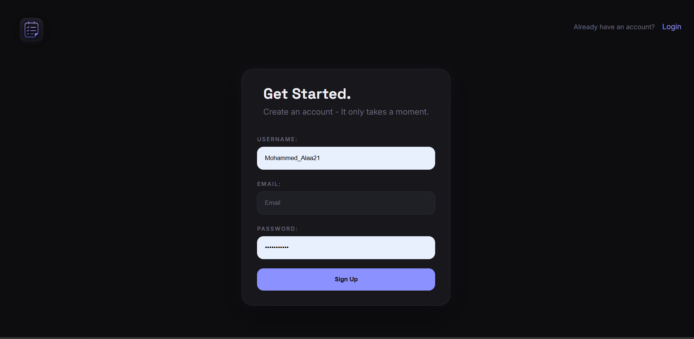

# 📝 TaskFlow

A modern full-stack Todo application built with **Node.js, Express.js, MongoDB, HTML, CSS, and Vanilla JavaScript**.

This project demonstrates secure authentication, RESTful APIs, CRUD operations, dynamic frontend rendering, and a responsive user interface.

---

## 🚀 Live Demo

**🔗 Live Application:** *https://task-flow-pbty.vercel.app/*

---

## Features

### Authentication

- ✅ User Registration
- ✅ User Login
- ✅ JWT Authentication
- ✅ Protected Routes
- ✅ Password Hashing with bcryptjs

### Todo Management

- ✅ Create Todos
- ✅ Edit Todo Status
- ✅ Delete Todos
- ✅ Multi-user Support
- ✅ Users can only access their own Todos

### Frontend

- ✅ Dynamic DOM Rendering
- ✅ Live Todo Filtering
- ✅ Remaining Tasks Counter
- ✅ Progress Bar
- ✅ Interactive UI Animations
- ✅ Logout Functionality

### Backend

- ✅ RESTful API
- ✅ MVC Architecture
- ✅ MongoDB with Mongoose
- ✅ Environment Variables
- ✅ Centralized Error Handling

---

## 🛠️ Tech Stack

| Frontend           | Backend    | Database |
| ------------------ | ---------- | -------- |
| HTML5              | Node.js    | MongoDB  |
| CSS3               | Express.js | Mongoose |
| Vanilla JavaScript | JWT        |          |

---

---

## 📸 Preview




---

## Project Structure

```text
.
├── assets/
├── back_end/
│   ├── config/
│   ├── controllers/
│   ├── middleware/
│   ├── models/
│   ├── routes/
│   ├── utils/
│   ├── app.js
│   ├── index.js
│   └── .env
│
├── front_end/
│   ├── forms/
│   ├── logo/
│   ├── scripts/
│   ├── styles/
│   └── index.html
│
├── package.json
└── README.md
```

---

## 📡 API Endpoints

### Authentication

| Method | Endpoint              |
| ------ | --------------------- |
| POST   | `/api/users/register` |
| POST   | `/api/users/login`    |

### Todos

Requires a valid JWT.

| Method | Endpoint         |
| ------ | ---------------- |
| GET    | `/api/todos`     |
| POST   | `/api/todos`     |
| PUT    | `/api/todos/:id` |
| DELETE | `/api/todos/:id` |

---

## What I Learned

- Building RESTful APIs
- JWT Authentication
- MongoDB & Mongoose
- MVC Architecture
- Full CRUD Operations
- DOM Manipulation
- Event Delegation
- Frontend State Management
- Connecting a frontend to a backend API
- Deploying a full-stack application

---

## 🔮 Future Improvements

- Refactor frontend into modules
- Responsive design
- Due dates
- Search functionality
- Dark/Light Theme
